<center><h1>DtCalc.jl</h1></center>

`DtCalc.jl` is a `Julia` package that turns Julia's REPL into an advanced graphical
calculator on `DomTerm`. It leverages the rich-media capability of `DomTerm` and the
expressive and computing power of `Julia`. 

`DomTerm` is special among exisiting web-based terminals for its unique way to
construct rendered scene. It directly inserts output into browser's DOM tree,
instead of drawing pixels on an HTML canvas, as other javascript
terminal applications do. This approach, at the expense of rendering speed brings up
rich structures of the output and a great potential to build advanced applications
on top of it. In a REPL environment, the trade-off seems justified as there is rarely
a need for very high speed screen drawing in an repetitive interactive 
trial-inspecting-correcting process.

`DtCalc.jl` can be viewed as a traditional console with `Jupyter`-like features.
It does not offer more features than Jupyter offers (actually much less at present).
On the other hand it feels familiar as a standard complying terminal REPL that is
both easier to install and easier to get started with.

`DtCalc.jl` overloads Julia's `display` function to display inline images and
typesetted mathematical formulas in `DomTerm`. Additionally it can call Maxima to do
symbolic manipulation. The following are some use examples.

## Getting Started
### 1. Install DomTerm
We should install DomTerm first before using DtCalc.jl. For instructions on how to
install DomTerm, visit www.domterm.org

### 2. Install DtCalc.jl
Launch Julia in DomTerm and run

```Julia
    use Pkg
    Pkg.clone("https://github.com/jingyuewang/DomTerm.jl.git")
    Pkg.clone("https://github.com/jingyuewang/MathMLRepr.jl.git")
    Pkg.clone("https://github.com/jingyuewang/SVGDraw.jl.git")
    Pkg.clone("https://github.com/jingyuewang/Mxma.jl.git")
    Pkg.clone("https://github.com/jingyuewang/DtCalc.jl.git")
```
This installs DtCalc.jl and all its components: DomTerm.jl, MathMLRepr.jl, SVGDraw.jl, and Mxma.jl.

## Showing Colors
Using the `Colors.jl` package we can easily examine a single color or experiment
with a slew of colors inline

``` Julia
    using DtCalc
    colorant"#2060A0"
    rand(RGB, 3, 3)
    [RGB(sin(x), sin(x)^2, rand()) for x in LinRange(0, π/2, 64)]'
```
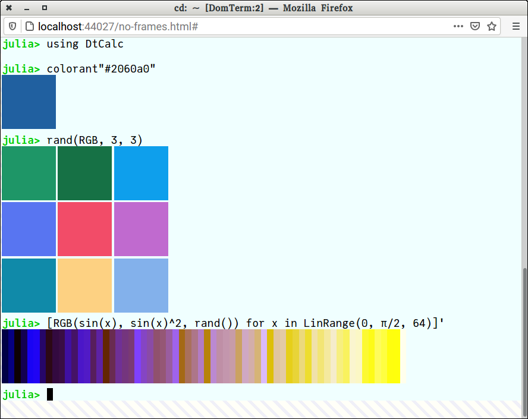
<br/><br/>

## Inline Images
With the help of `Images.jl` we can easily view images inline or quickly create a
grid-preview of all images in a directory
```Julia    
    cd("image/dir")
    im = load("100075.jpeg")
    preview_dir(".", index=1:10)
```
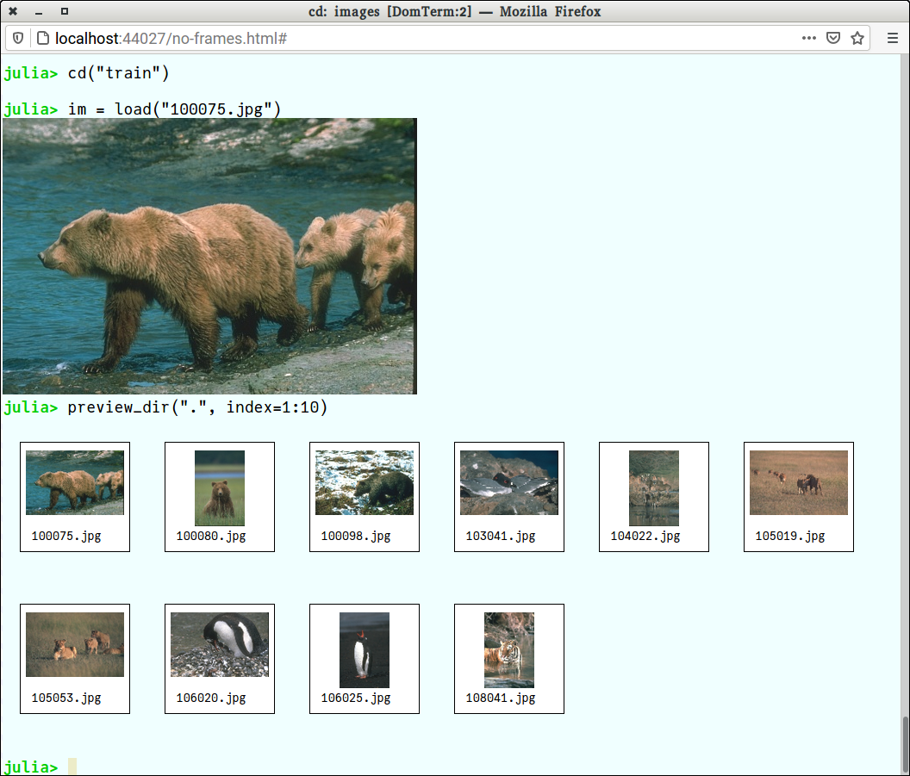
<br/><br/>


## Typesetting Vectors, and Matrices.
`DtCalc` can display typesetted TeX/LaTeX code on DomTerm screen. Internally it
translates TeX/LaTeX into MathML and send the generated MathML to
a browser window <sup>[1](#myfootnote1)</sup>. In addition to TeX, it can optionally typeset
Julia Vectors and Matrices. Converting more Julia types (e.g.,
the symbolic type) and other markup math formats (e.g, UnicodeMath) is currently
under development.

Inline typesetting can be enabled by running
```Julia
typeset_matrix(true)
```
Then a vector output in REPL will be typesetted

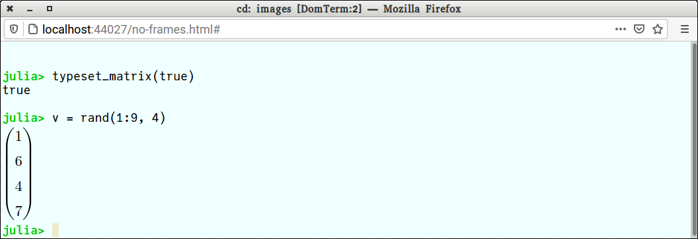
<br/><br/>

We can do LU factorization for a rational matrix $A$ and check the typesetted result.
```Julia
    A = convert.(Rational, rand(1:15, 3, 3)
    r = lu(A);
    r.L
    r.U
```
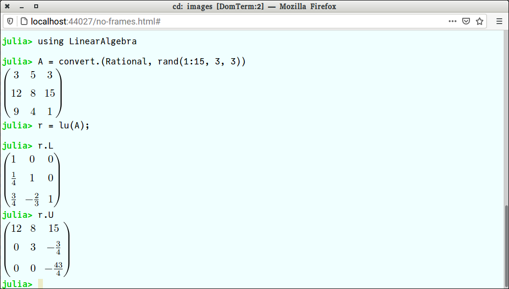
<br/><br/>

We can display multiple matrices in a row using string interpolation.
The  interpolation syntax is stealed from `LaTeXStrings.jl`, though we did not really
use the `LaTexString` type in `DtCalc`. Note that we use macro string `l"..."` to 
generate a `LATEX` object.
```Julia
    htprint("The LU factorization of A yields", l"L=%$(r.L), U=%$(r.U)")
```
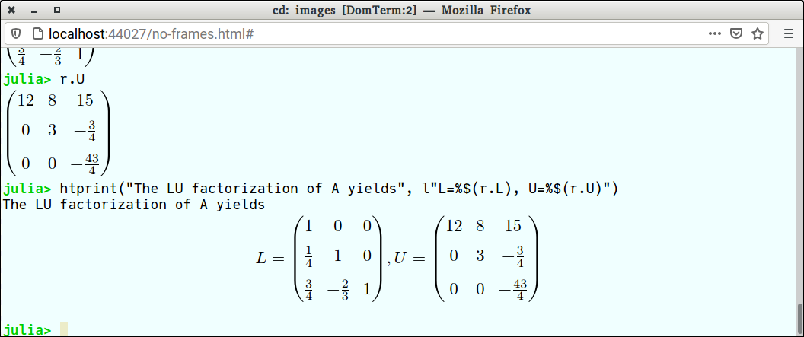
<br/><br/>

The `htprint()` function in this example can display both HTML and LATEX objects.

Let's solve a linear equation system.

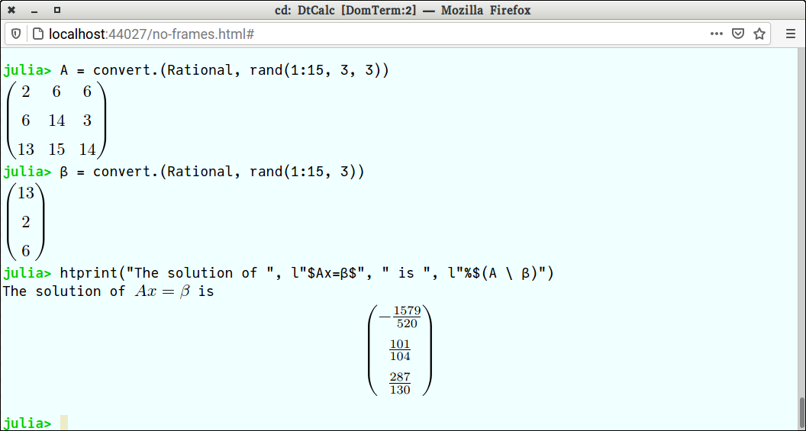
<br/><br/>

## Drawing with Luxor
We can use `Luxor.jl` to draw graphics on screen. To enable Luxor inline display, run

``` Julia
    displayinline(Luxor)
```
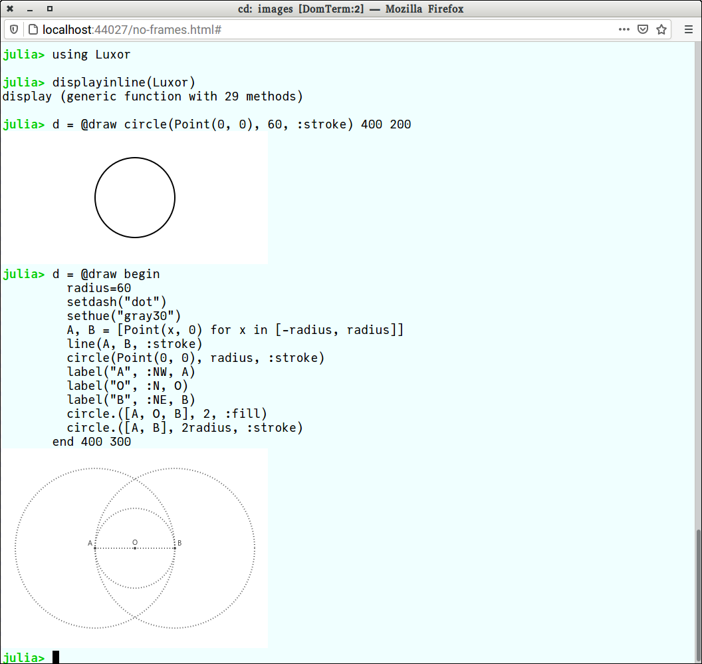
<br/><br/>

## Stylized IEEE754 Floating Point Number Format Illustration
`DtCalc` has its own SVG drawing facilities in `SVGDraw.jl`. This package privides
a Julia programming interface to generate vector graphics. Unlike `Luxor`, it has no
external dependence (not depending on Cairo or other rendering libraries). The
following example shows a stylized IEEE754 floating point format illustration. It
actually reproduces (unfaithfully) the illustration shown in the wikipedia page on
IEEE754 floating point format. The code is relatively short and quite straightforward
thanks to Julia's expressiveness. 

```Julia
const expbitlen = Dict([
    Float64 => 11,
    Float32 => 8,
    Float16 => 5
    ])
__FloatType = Union{Float64, Float32, Float16}

function showIEEE754(x::__FloatType)
    # NOTE: the first char in the bit string is the hightest bit.
    bs = bitstring(x)
    bitlen=length(bs)
    exp_bitlen = expbitlen[typeof(x)]

    ## All to be drawn:
    # 64 boxes, the top-left corner of the first box is the origin.
    # three over-brackets (including one degenerated).
    # three circles.
    boxes = Vector{Rect}(undef, bitlen)
    ovbrs = Vector{Brace}(undef, 3)
    circles = Vector{Circ}(undef, 3)
    # parameters
    boxwidth, boxheight = 14, 28
    circ_offset = R²(0, 5)
    r = 5

    # create boxes
    for i in 1:bitlen
        boxes[i] = Rect((i-1)*boxwidth, 0, boxwidth, boxheight, label=string(bs[i]))
    end

    # create overbrackets
    ovbrs[1] = Brace(boxes[1], label="sign")
    ovbrs[2] = Brace(boxes[2], boxes[1+exp_bitlen], label="exponent\n($exp_bitlen bit)")
    ovbrs[3] = Brace(boxes[2+exp_bitlen], boxes[bitlen],
                     label="fraction\n($(bitlen - 1 - exp_bitlen) bit)")

    # create circles
    circles[1] = Circ(midbottom(boxes[1]) + circ_offset + (0, r), r, label="$(bitlen - 1)")
    circles[2] = Circ(midbottom(boxes[1+exp_bitlen]) + circ_offset + (0, r), r,
                      label="$(bitlen - 1 - exp_bitlen)")
    circles[3] = Circ(midbottom(boxes[bitlen]) + circ_offset + (0, r), r, label="0")

    # set class, id, and styles
    boxes[1].id = "box1"
    for i = 2:bitlen
        boxes[i].class = (2 <= i <= 1+exp_bitlen ? "expbox" : "fracbox")
    end
    ovbrs[1].id = "overbrace1"
    css = CssRules([
        ("#overbrace1", "--vg-offset: 0.5;"), # 0.5 or greater values: degenerated brace
        ("#box1", "fill: cyan;"),
        (".expbox", "fill: lightgreen;"),
        (".fracbox", "fill: yellow;"),
        ("Rect", "--vg-label-side: center;"),
        ("Brace", "stroke: blue; --vg-shape: bracket; --vg-side: above; --vg-label-side: above;"),
        ("Circ", "fill: pink; --vg-label-side: below;"),
    ])
    if typeof(x) == Float16
        css["#overbrace1"] *= "--vg-label-anchor: end;"
    end
    # write to a svg string and display it
    svg = make_svg_root(boxes, ovbrs, circles; css)
    hput(svg)
    println()
end
```
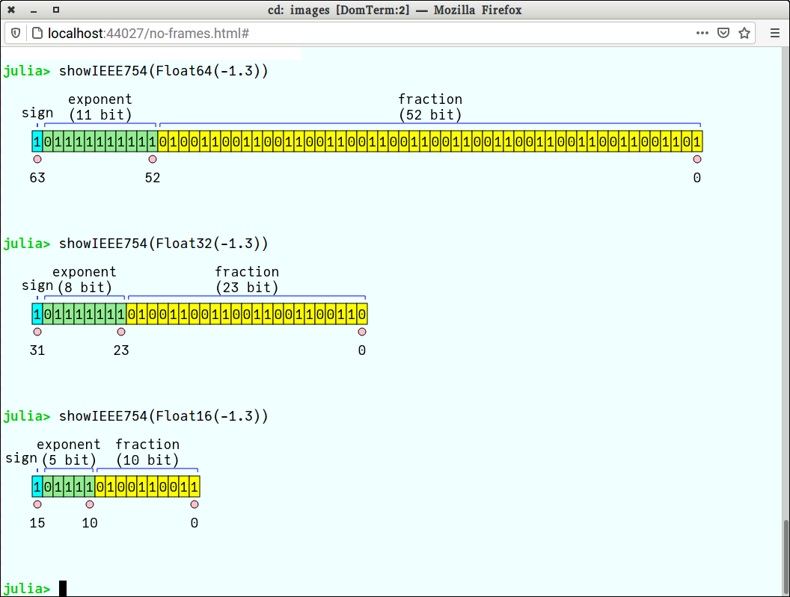
<br/><br/>

## Data Plotting
We can plot data in DomTerm with `GR.jl` or `Gnuplot.jl` (both tested on Linux).
Other plotting packages may work as well.

We first load `GR` and enable GR inline display
```Julia
    using GR
    displayinline(GR)
```
Then use `GR` as usual
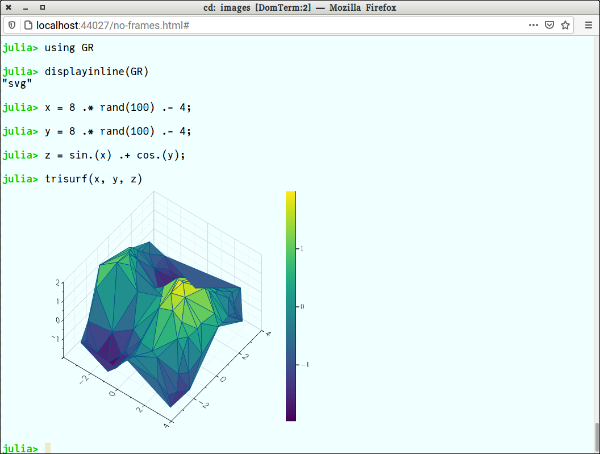
<br/><br/>

`Gnuplot` is a bit special. It supports `DomTerm` natively thus we do not even
have to add `using DtCalc`. But we still need to use a Julia
wrapper (e.g., `Gnuplot.jl`) to run Gnuplot commands.

The following example is tested on `Gnuplot.jl` version 1.3.0

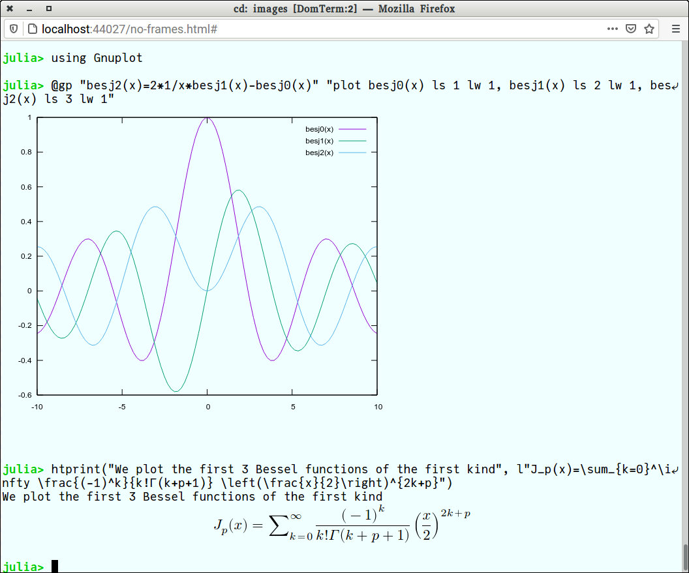
<br/><br/>

## Tables and DataFrames
Displaying HTML tables is trivial in DomTerm. 

```Julia
    using DataFrames, RDatasets
    displayinline(DataFrames)
    d = dataset("datasets", "iris")
```
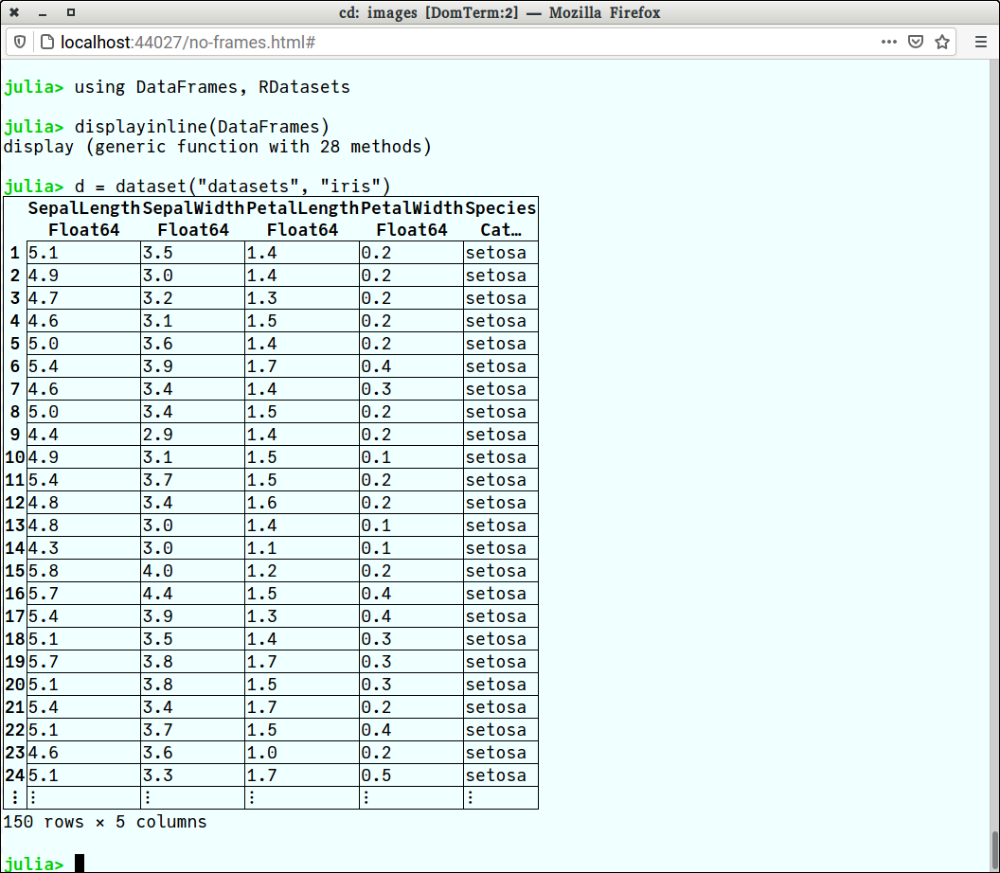
<br/><br/>

We can also extract the HTML code for a `DataFrame` and re-style its display. For
example, a table is by default left-justified. We can put it at center horizontally.
```Julia
    # get the HTML code of the table
    buf = IOBuffer(); show(buf, "text/html", first(d,10)); h = String(take!(buf));

    # put the table at center horizontally, dt_addst is exported in DomTerm.jl
    dt_addst(".centerizer * {margin: 0 auto; text-align: center}")
    hput(make_div("", h; class="centerizer"))

```
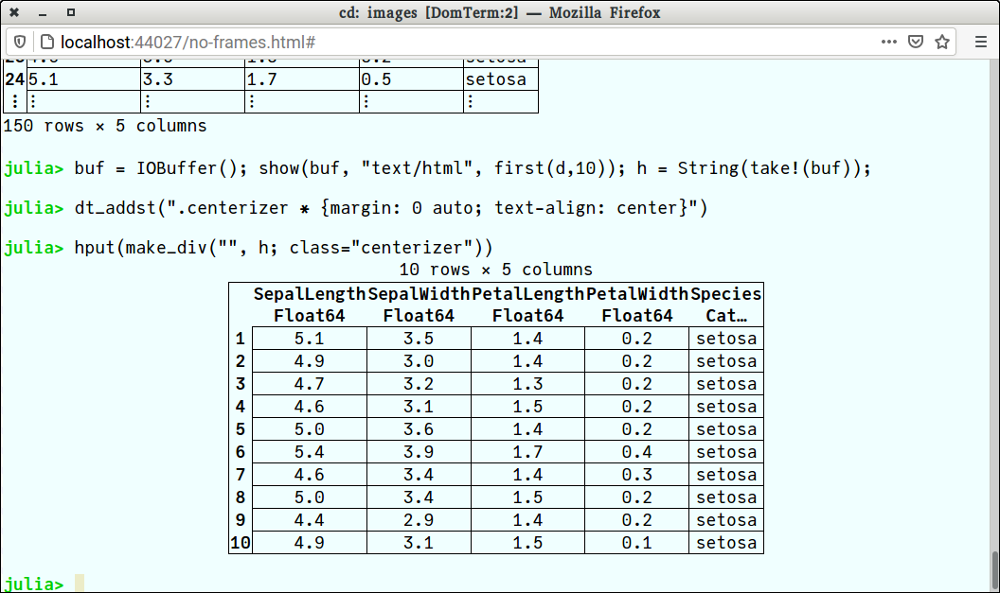
<br/><br/>


## Maxima Driven Symbolic Math Calculation
`DtCalc` provides a Julian wrapper `Mxma.jl` for calling Maxima functions in Julia.
This package is a fork of `Maxima.jl`. To use `Mxma.jl`, we must install
`Maxima` and the executable `maxima` must be in one of the environment PATHs.

To run Maxima commands, we use function `mcall()` or macro function `@mx`. Both
return a `MExpr` object that saves the execution result, a Maxima expression.

`@mx` and `mcall()` can take Julia expressions and translate them into Maxima
expressions before sending them to the computing server. This helps users who are
more familiar
with Julia to stay within Julia's syntax, instead of switching back and
forth between two different sets of syntax rules. However there is one
important
exception at the moment: the expression `A*B` for two matrices `A` and `B`
represents their element-wise multiplication, not their matrix multiplication
as is in Julia. This
is how Maxima treats the `*` operator. As the `*` symbol is also used in regular
multiplications (e.g., the product of two scalars), it is not trivial to single
out those cases where `*` is only used in matrix multiplications and reset the
operator to `.` which is the real matrix multiplication operator in Maxima. So
we keep its Maxima semantics for now. We use `A∘B` at the moment to represent
the matrix multiplication of `A` and `B` as a temporary workaround before
we fully implement Julia-`*` operator in matrix multiplication (`∘` can be inputed
in Julia REPL by typing `\circ` followed by pressing <key>TAB</key> in any
modern terminal emulator that supports unicode char display. Also
the font in use should contain the char's glyph). 

At the moment, only variable/equation definition,
function call, and a few special constants (e.g., π, ℯ, etc) can use
Julia syntax. More sophisticated Maxima statements, e.g, 
those involving loops and branches, have to be written in a string and
call `mcall` or `@mx` on the string.

Here are some examples of using Mxma.jl to do symbolic math.

### Defining variables and equations
Defining a varible can simply be like `a=1` insteand of the Maxima way `a:1`.
The following line defines a polynomial `f` (Note that the second term
`2x` is a Julia expression, not a Maxima expression. After all it is a part of a
macro function argument).

```Julia
    @mx  f = x^2 + 2x + 1
```
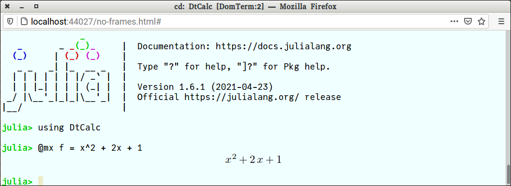
<br/><br/>

Moreover, we can directly take vectors and matrices defined in Julia and use them as
Maxima variables via calling `@mx use`.

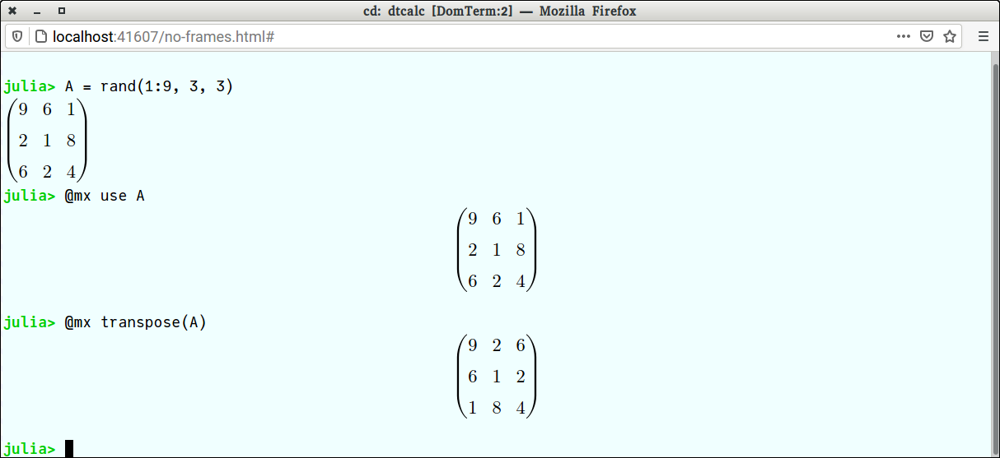
<br/><br/>

The following example calculates the characteristic polynomial of a $3\times 3$
matrix defined in Julia

```Julia
    M = rand(1:15, 3, 3)
    @mx use M
    @mx expand(charpoly(M, λ))
```

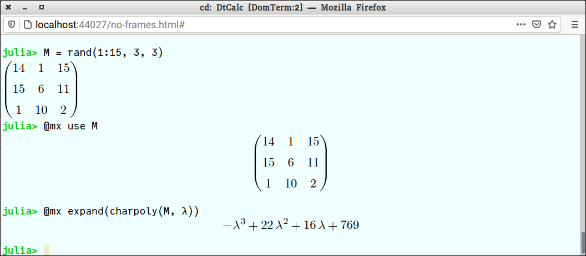
<br/><br/>

We can use Julia notation to reference math constants. For example
the half circumference of a unit circle is represented by the unicode char $\pi$,
no need to use the Maxima notation `%pi`

```Julia
    @mx [cos(π/3), cos(π/4), cos(π/6)]
    @mx trigrat(sin(3a)/sin(a+π/3))
```

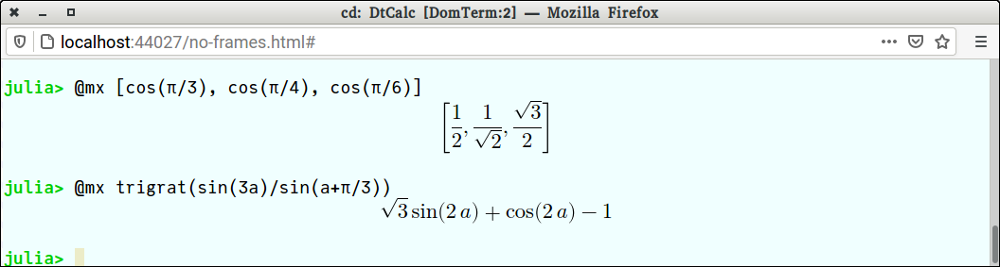
<br/><br/>

Equation numbering is also different from Maxima's original way. We
put equation label behind the equations, e.g., 

```Julia
    @mx x^2 + y^2 =1 (eq1)
    @mx y=ax (eq2)
    @mx solve([eq1, eq2], [x, y])
```

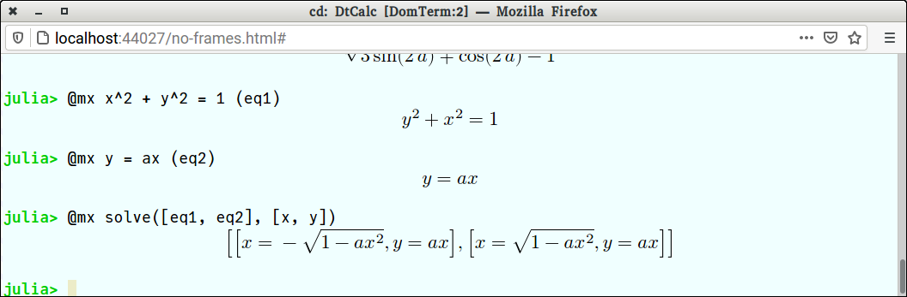
<br/><br/>

Putting parenthesis around labels is not necessary, but they are better
kept in order to exhibit the role of the labels more clearly.

To execute sophisticated Maxima commands or batch executing auto-generated
commands, we can resort to calling `mcall` or `@mx` with command strings
that contain real Maxima commands.

```Julia
    @mx "assume(p>0, a>0)"
    @mx "specint(t^(1/2)*%e^(-a*t/4)*%e^(-p*t),t)"
    htprintl"\int t^{1/2}*ℯ^{-a*t/4}*ℯ^{-p*t}\,dt"
```

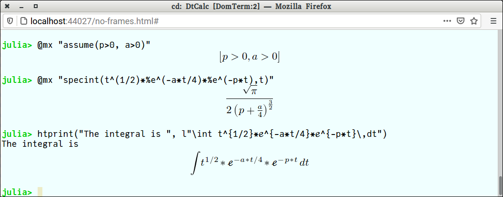
<br/><br/>

### Printing a small integral table
The following code snippet prints out a small indefinite integral table.
It calls Maxima to calculate the anti-derivative for a given
list of functions, converts the representation of the results from
MExpr to Tex, then formats each equation in TeX. Finally the TeX code is
converted into MathML that shall be inserted in a HTML table (actually just
a grid of floating HTML `div`s). We print out the table by calling
`hprintln()` which simply sends HTML code to DomTerm.
```Julia
using DtCalc
using MathMLRepr

function make_table(e)
    style = """
    width: 90%; min-height: 10px; margin: 10px; padding: 20px;
    border: solid black; border-width: 1px;
    """
    return make_div(style, e)
end

make_one_item(e) = make_div("width: 50%; height: 60px; float: left;", e)

function dotable()
    table_content = ""
    mcall("assume(k>0)")
    for integrand in ["sin(u)", "cos(u)", "u^k", "1/u",
                      "sec(u)^2", "tan(u)", "1/sqrt(a^2-u^2)", "1/(a^2+u^2)"]
        g = mexpr_to_tex(mcall("f: "*integrand))
        result = mexpr_to_tex(mcall("integrate(f, u)"))
        mml = tex_to_mml(l"\int "*g*l"\,du = "*result)
        table_content *= make_one_item(mml)
    end
    return make_table(table_content*make_newline())
end
htprint(dotable())
```
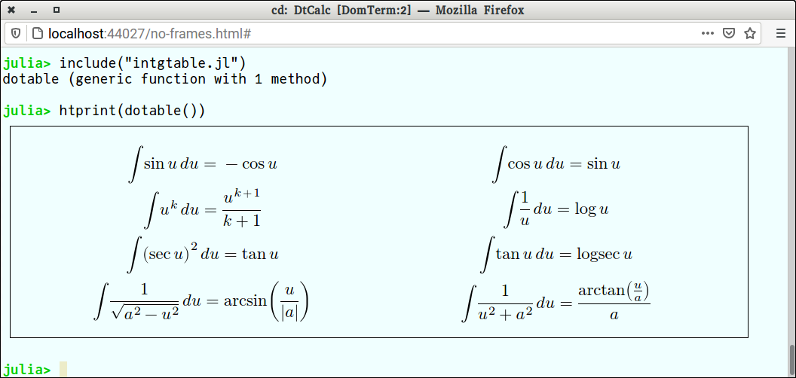
<br/><br/>

### A few more examples in algebra
long division and gcd
```Julia
    @mx divide(3x^4+x^3+x+3, 2x^2+x+1)
    @mx gcd(x^4+x^2-2, x^3+x^2-2x-2)
```
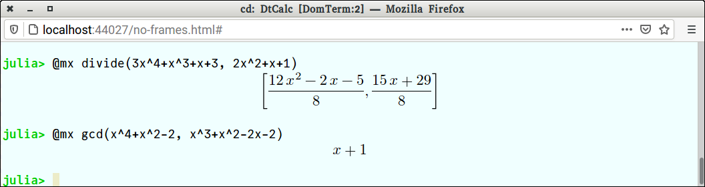
<br/><br/>

factorization
```Julia
    @mx factor(-8y-4x+z^2*(2y+x))
    @mx factor(1+e^(3x))
```
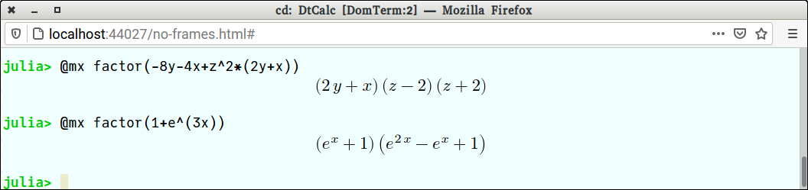
<br/><br/>

calculate the charateristic polynomial by the definition
```Julia
    using LinearAlgebra
    A = random(1:9, 3, 3)
    I3 = I + zeros(Int, 3, 3)
    @mx use A I3
    @mx expand(determinant(λ * I3 - A))
```
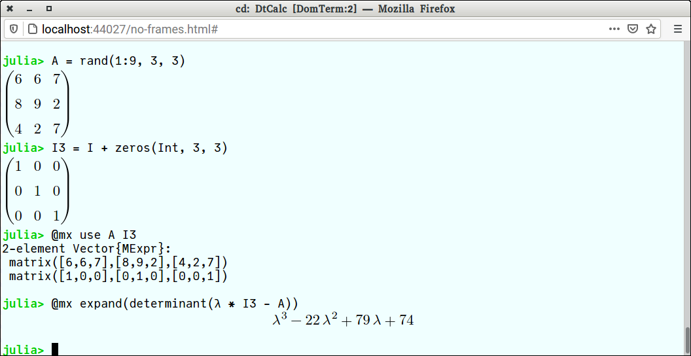
<br/><br/>

## Notes:
<a name="myfootnote1">1</a>: 
Due to lack of support for MathML in Chromium-based browsers, typesetting
math formula is only possible on Firefox (tested on Linux) and Safari (not tested). 
There is on-going effort to add MathML support to upstream Chromium. For the
latest update, visit mathml.igalia.com

2: This project is far from reaching alpha phase. More features are 
being planed or under development at present. Bug reports are welcome.


